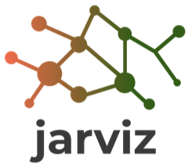

# Jarviz Graph Tool

Jarviz graph tool is designed for graphing the dependency coupling data for Java applications. The dependency coupling data provided as a [JSON Lines (.jsonl)](http://jsonlines.org/) file is generated from [Jarviz Java library](../jarviz-lib).

In order to run the tool, Jarviz Graph expects [node](https://nodejs.org) and [npm](https://www.npmjs.com/get-npm) to be installed in the system as a prerequisite.

### Sample Dependency Graph


## Usage

### Development

- Clone the repository
- Run following command:

```shell
$ npm install
$ npm run build:example
```

The output is generated as HTML files in the `build` directory using the mock coupling data from `lib/mock` directory.

### Command

To generate the HTML graph using specified coupling data, run:

```shell
npx "@homeaway/jarviz-graph" -i <Input Directory> -o <Output Directory>
```

### Parameters

```
-i, --input <path>    Input path to the directory containing Jarviz JSONL
-o, --output <path>   Output path to the directory for HTML graph
```

## Legal

This project is available under the [Apache 2.0 License](http://www.apache.org/licenses/LICENSE-2.0.html).

Copyright 2020 Expedia, Inc.
